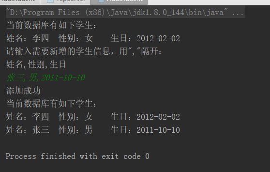

# Java第二阶段工作成果

## 学习内容

* 第15章 I/O

  学习了输入/输出流的分类、文件输入/输出流的使用方法、带缓存的输入/输出流的使用方法以及ZIP压缩shuru/输出流。

* 第16章 反射

  主要学习了如何通过反射访问构造方法、成员变量、访问方法，此外还学习了Annotation，利用Annotatio功能可以对类、构造方法、成员变量、方法、参数等进行注释，在程序运行时可以通过反射读取这些信息。

* 第17章 枚举类型与泛型

  主要学习了枚举类型以及泛型的用法

* 第18章 多线程

  本章学习的多线程，主要学习了多线程实现的两种方法，多线程的生命周期，多线程的操作方法，多线程的优先级以及多线程的同步机制。多线程是一种复杂的机制，需要进一步深入学习，加强理解。

* 第19章 网络通信

  主要学习了TCP、UDP网络编程以及二者的区别

* 第20章 数据库操作

  主要学习了数据库的种类，功能以及常用的SQL语言的基本语法，使用JDBC技术操作数据库，以及对数据执行增、删、改、查的操作方法。

## 作业完成情况

  1，完成了第15-20章的课后习题以及增补习题，其中第20 章的习题中采用了postgresql数据库。

* 创建SearchEmp，实现查找数据表tb_emp中销售部的所有成员功能,控制台和数据库效果图如下：
 

 

* 向数据表tb_stu中添加数据功能，要求姓名为“李某”，性别是“女”，出生日期是“1991-10-20.控制台和数据库效果图如下：

* 删除出生日期在“2010-01-01”之前的学生,控制台和数据库效果图如下：

 
 

2，控制台输出完成了投票系统。控制台效果图如下：

