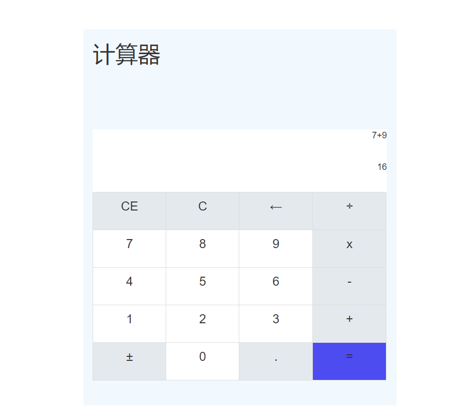
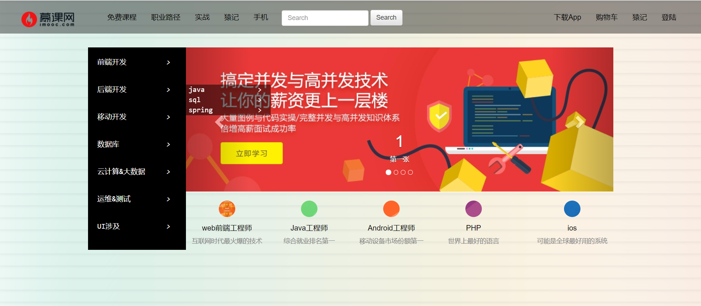

# Web前端基础第三阶段作业

## 开发环境

* IDE开发工具：VSCode

* 采用HTML、CSS、Bootstrap 、JavaScript。

## 作业一  计算器

* 采用html，css，bootstrap以及、JavaScript。实现了Windows计算器中加、减、 乘、 等基本功能。如图所示

## 作业二 多级下拉菜单

采用html，css，bootstrap以及jquery模仿慕课网页面实现了一个多级下拉菜单页面。如图所示，该页面做了顶部导航栏，左侧导航菜单，幻灯片等，其中左侧导航菜单实现多级下拉菜单功能。

## 总结

对原生jS的理解不深，需要加强。